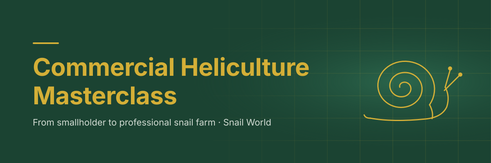

# Commercial Heliculture Masterclass: Visual Assets

**Snail World (snailworld.org) · ProductDyno Product ID 44288**

Image prompts and graphical layout specs for the course pages.

| File | What it is | Use |
|---|---|---|
| [image-prompts.md](image-prompts.md) | Midjourney and Nano Banana prompts for Modules 1–8 | Module hero images (mood only) |
| [hero-banner.svg](hero-banner.svg) | Course hero banner, 1200 × 400 | Course landing page and the ProductDyno header |
| [hero-banner-mobile.svg](hero-banner-mobile.svg) | Stacked mobile banner, 750 × 500 | Screens ≤ 640 px wide |
| [module-3-7-kpi-grid.html](module-3-7-kpi-grid.html) | 3-column flexbox KPI grid comparing CapEx, FCR and projected margin | Module 3 and Module 7 lesson pages |
| [module-2-trench-pen-cross-section.svg](module-2-trench-pen-cross-section.svg) | Technical schematic of a trench pen: drainage, airflow, substrate layers, mesh boundaries | Module 2 lesson and the Pen Specification Checklist |

## Brand Tokens

| Token | Hex | Rule |
|---|---|---|
| Forest (primary) | `#1B4332` | Backgrounds, headings |
| Forest 2 (secondary) | `#2D6A4F` | Glows, secondary fills |
| Gold (accent) | `#D4AF37` | Titles **on forest only** (contrast ≈ 5.3 : 1, passes WCAG AA). On white, use gold for rules and borders only, never for text. |
| Warm white | `#F1F5EE` | Text on forest |
| Ink | `#14281F` | Body text on light surfaces |

Font: Inter, with Helvetica Neue and Arial as fallbacks.

## 1. Hero Banner

- **Desktop:** 1200 × 400. The title and subtitle sit in the left half (x 80–560). The farming-tier grid fades in from about 40 % across, and the line-art snail sits on the right (centred around x 985).
- **Mobile:** the 1200 × 400 layout shrinks the title to about 20 px on a phone, so a stacked 750 × 500 variant is supplied (snail top right, title in three lines). Switch between them with `<picture>`:

```html
<picture>
  <source media="(max-width: 640px)" srcset="hero-banner-mobile.svg">
  
</picture>
```

- **Fonts in production:** the SVG text uses the system font stack. For pixel-identical output everywhere, convert the text to outlines (Inkscape: *Path → Object to Path*; Illustrator: *Create Outlines*) or export a PNG at 2× (2400 × 800) for platforms that strip SVG.
- **Uploading to BD and ProductDyno:** if the platform rejects SVG uploads, export PNG at 2400 × 800 (desktop) and 1500 × 1000 (mobile).
- **AI hero images (from `image-prompts.md`):** keep the left 40 % of each frame quiet so a title overlay sits in the same place as on the banner.

## 2. KPI Grid (Modules 3 and 7)

- **Structure:** `.sw-kpi-grid` is a flex container (`flex-wrap: wrap; gap: 16px`). Each `.sw-kpi-card` is set to `flex: 1 1 280px`, giving three columns at 900 px and above and a single stacked column on phones. A 4 px gold top border carries the brand accent.
- **Cards:** Capital cost per m², feed conversion ratio, and projected gross margin per m². Each card compares outdoor pens, polytunnels and indoor racks.
- **Filling in values:** every value shows "—" and carries `data-empty` until a real figure is entered. Replace the dash with the farm's own figure from the Module 3 calculator (FCR) or the Module 7 model (CapEx, margin), then remove `data-empty`. Each `data-field` attribute names the cell so it can be filled by script.
- **Why no sample numbers:** CapEx and margins vary widely by country, currency and system. Publishing illustrative figures risks students treating them as benchmarks.
- **Pasting into BD:** copy the `<style>` block once into the site's custom CSS, then paste the `<section class="sw-kpi-section">` snippet into the post's HTML view. The snippet uses no `<table>`, so it passes BD's content filter.
- **Dark mode:** handled by `prefers-color-scheme` and `[data-theme="dark"]`.

## 3. Trench Pen Cross-Section (Module 2)

- **Section A (across the trench):**
  - shade roof with cross-ventilation airflow (roof not to scale);
  - latched mesh lid, 3–5 mm mesh (1–2 mm for nurseries);
  - block walls with a 10 cm curb;
  - optional buried mesh skirt, 20–30 cm deep, for earth walls;
  - 15–20 cm of moist loam substrate (pH 7–8) over a separator and 5–10 cm of gravel with a perforated drain;
  - depth ≈ 50 cm, internal width 1.0–1.2 m;
  - surrounding ground falling 1–3 % away from the trench.
- **Section B (along the trench, vertical scale exaggerated):**
  - base falls 1–2 % to the outlet end;
  - drain passes through a ≤ 2 mm outlet screen into a gravel soakaway;
  - cut-off drain diverts surface run-off.
- **Dimensions are indicative.** Adapt them to the site, species and local building practice. The figures match the Module 2 lesson and the Pen Specification Checklist, so update all three together.
- **Accessibility:** the SVG has `role="img"` with a title and description. In the lesson, give the image a caption that repeats the key dimensions as text.
